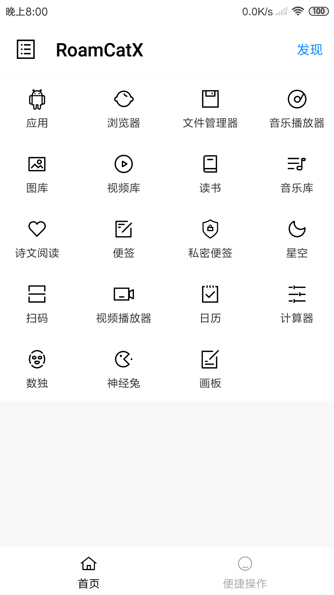
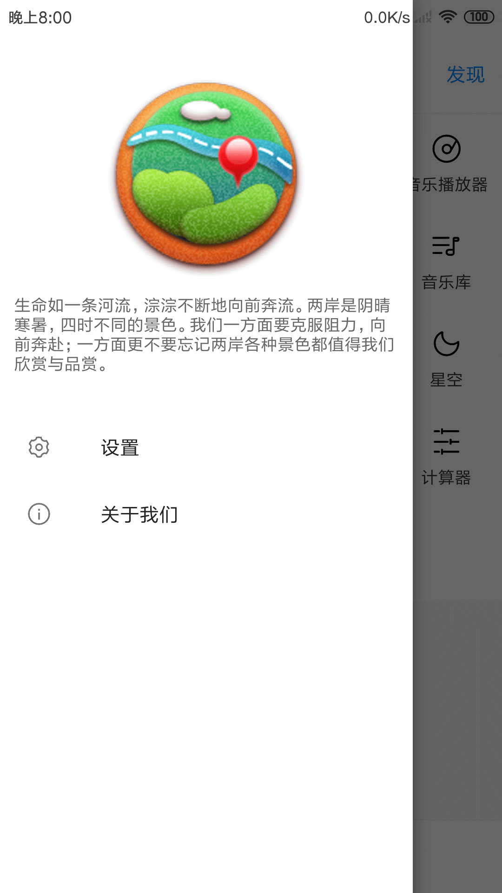

# RoamCatX

[应用下载 Download](http://res.ehorizon.top/roamcat/download-x.html)

*RoamCatX* 是一个工具类的安卓应用，可以方便地管理手机数据，同时提供了一些便捷小工具。
代码主要使用kotlin语言，代码中使用了一些优秀的开源库，再次向这些开源库的作者们表示感谢。

*RoamCatX* is a tool-based android app that makes it easy to manage your phone's data and offers handy gadgets.
The code mainly USES the kotlin language and USES some excellent open source libraries. Thanks again to the authors of these open source libraries.

screenshot home|screenshot menu
:-:|:-:
|

-- End --

